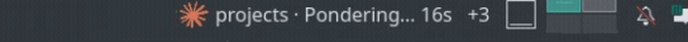
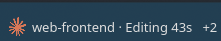
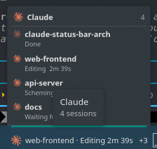
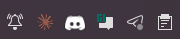

# claude-status-bar (Linux)

Shows Claude Code activity in your panel / status bar, ported from the macOS
project [m1ckc3s/claude-status-bar](https://github.com/m1ckc3s/claude-status-bar).
Best on **KDE Plasma 6** (a real inline panel widget), with first-class support
for **Waybar** and any script-driven panel (polybar, i3blocks, xfce4-genmon, …),
and a system-tray fallback everywhere else.



## Install

**Arch / Manjaro** — system-wide package:

```sh
makepkg -si                 # builds + installs the binary and plasmoid
claude-status-bar install   # wire the Claude Code hooks (per-user)
```

**Any other distro** (Debian/Ubuntu, Fedora, openSUSE, …) — no root:

```sh
./install.sh                # builds → ~/.local/bin, wires hooks, sets up the
                            # best UI it can detect for your desktop
```

Then start a **new** Claude Code session. System-wide without a package manager:
`sudo make install PREFIX=/usr`. Make sure the [dependencies](#dependencies) below
are present first. Per-panel snippets: [`packaging/panels.md`](packaging/panels.md).

## Dependencies

**Build (strict):**

- Rust toolchain (`cargo`).
- `pkg-config` + libdbus development headers — the binary always links `libdbus-1`
  for the tray (`ksni`), so they're required even on KDE. By distro:
  - **Arch / Manjaro:** `dbus` (part of the base system — already present)
  - **Debian / Ubuntu:** `libdbus-1-dev pkg-config`
  - **Fedora / RHEL:** `dbus-devel pkgconf-pkg-config`
  - **openSUSE:** `dbus-1-devel pkg-config`

**Runtime (strict):**

- Claude Code.
- A running D-Bus session bus (standard on every Linux desktop) — used only by the
  tray fallback.
- **KDE only:** `plasma-workspace` (provides the panel host and the
  `plasma5support` datasource the widget reads through).

No Node, no Python, no web runtime.

## Screenshots

The **KDE Plasma 6 panel widget** puts the project, current activity and a live
timer inline in your panel — like the macOS menu bar — with a `+N` badge when
other Claude sessions are running:



Click it for a popup listing **every live session** with its project, activity and
elapsed time (the busiest one drives the bar):



> Regenerate these any time with [`scripts/demo-pose.sh`](scripts/demo-pose.sh) —
> see [`docs/screenshots/README.md`](docs/screenshots/README.md).

## Architecture

Two decoupled layers communicating through files under `~/.claude/statusbar/`,
identical in spirit to the macOS original:

- **Layer A — hooks (Rust `claude-status-bar hook <event>`).** Claude Code fires
  lifecycle/tool events; each runs the binary, which receives a JSON payload on
  stdin and writes **one state file per session** at `sessions.d/<id>.json` (each
  session keeps its own sticky fields — e.g. its own elapsed-timer start), plus an
  aggregate `state.json` (most-recently-active wins) for the tray fallback. Sticky
  fields are loaded from that session's own file, so concurrent sessions never
  clobber each other. Pure Rust, single binary, links only `libc`
  (+ `libdbus-1` for the optional tray, below).
- **Reporting commands (the portability layer).** The same session data is read
  out in whatever format a consumer wants:
  - `claude-status-bar sessions` → JSON array (KDE plasmoid)
  - `claude-status-bar status` → one plain-text line (polybar, i3blocks, genmon, …)
  - `claude-status-bar waybar` → Waybar JSON (`text`/`tooltip`/`class`)
- **Layer B — UI. Two options, both read the same `state.json`:**
  - **Plasma panel widget (recommended)** — a QML plasmoid in `plasmoid/`. Shows
    the Claude spark **plus an always-visible status label** ("Editing  43s") at
    full panel height, like the macOS menu bar. With several Claude sessions live,
    the bar shows the busiest one with a `+N` badge; **click it for a popup listing
    every session** (project · activity · timer). The popup width auto-matches the
    bar.
  - **System-tray icon (fallback, `claude-status-bar` with no subcommand)** — a
    Rust `ksni`/StatusNotifierItem indicator showing the **same Claude spark as the
    panel** (the real `claude.png`, dimmed when idle and brighter/pulsing when
    busy). Works on any SNI host (XFCE, etc.), but a tray icon **cannot show inline
    text** (SNI has no such field) — the status text is only in the hover tooltip.
    Use this only off KDE/where a panel widget isn't an option.

`state.json` schema (field names match the macOS app, so the two are
wire-compatible):

```json
{
  "state": "idle|thinking|tool|permission|waiting|done",
  "label": "Editing",
  "tool": "Edit",
  "project": "my-repo",
  "sessionId": "abc123",
  "transcript": "/path/to/transcript.jsonl",
  "startedAt": 1750000000,
  "ts": 1750000000
}
```

### Source layout

| File | Responsibility |
|------|----------------|
| `src/main.rs`    | argument dispatch (`hook` / `install` / `uninstall` / tray) |
| `src/paths.rs`   | filesystem locations |
| `src/state.rs`   | `state.json` schema, atomic load/save, elapsed timer |
| `src/hook.rs`    | Layer A — event → state translation, session tracking |
| `src/icon.rs`    | decode/scale the embedded `claude.png` into the tray pixmap (same icon as the plasmoid) |
| `src/tray.rs`    | Layer B fallback — ksni `Tray` impl + animation/reload loop |
| `src/install.rs` | additive `settings.json` hook merge |
| `plasmoid/metadata.json`        | Plasma 6 applet manifest |
| `plasmoid/contents/ui/main.qml` | Layer B (KDE) — panel widget: spark + inline label |
| `plasmoid/contents/icons/claude.png` | the Claude spark asset |
| `scripts/install-plasmoid.sh`   | deploy plasmoid + add to panel |

## Desktop support

Portability is by **desktop environment**, not distro — the binary builds and the
hooks run on Arch, Debian/Ubuntu, Fedora, openSUSE, etc. all the same. What differs
is how the status is shown:

| Environment | How | Inline text? |
|-------------|-----|--------------|
| **KDE Plasma 6** (any distro) | native panel widget (plasmoid) | ✅ yes — full experience, multi-session popup |
| **Waybar** (sway/Hyprland/wlroots) | `custom/claude` module → `claude-status-bar waybar` | ✅ yes |
| **polybar / i3blocks / xfce4-genmon / tint2 / dwmblocks / eww** | run `claude-status-bar status` on a 1 s timer | ✅ yes |
| **XFCE / Cinnamon / MATE / LXQt / Budgie** | system-tray icon, or a script panel above | tray: tooltip only |
| **GNOME** (Ubuntu/Fedora default) | tray via `AppIndicator` extension | tooltip only* |
| KDE Plasma **5** | tray fallback only (plasmoid needs Plasma 6) | tooltip only |

\* GNOME's top bar can't host arbitrary inline-text applets without a custom GNOME
Shell extension. Snippets for every panel are in
[`packaging/panels.md`](packaging/panels.md).

## Install via package (Arch / Manjaro)

```sh
makepkg -si          # builds + installs the binary and the plasmoid system-wide
claude-status-bar install   # wire the hooks into ~/.claude/settings.json (per-user)
# then: panel -> Add Widgets -> "Claude Status Bar", and start a new Claude session
```

The package installs `/usr/bin/claude-status-bar` and the plasmoid under
`/usr/share/plasma/plasmoids/`. The hooks and the panel widget are per-user, so
those two steps stay manual.

## Install from source (KDE — dev)

```sh
cargo build --release
./target/release/claude-status-bar install   # Layer A: wire up the hooks
bash scripts/install-plasmoid.sh             # Layer B: deploy + add the panel widget
```

`install` backs up `~/.claude/settings.json` to `settings.json.bak-statusbar` and
additively merges the hooks (existing hooks preserved; re-running is idempotent —
it replaces only its own entries). Then start a **new** Claude Code session, since
hook changes are picked up only by newly started sessions.

`install-plasmoid.sh` installs the KPackage to
`~/.local/share/plasma/plasmoids/io.github.benonii.claudestatusbar/` (baking the absolute
`claude-status-bar sessions` command into the QML) and adds the widget to your
first panel. It lands at the panel's right end — **drag it where you want** (left,
for the menu-bar look) via right-click → Enter Edit Mode.

## Tray fallback (non-KDE)

```sh
./target/release/claude-status-bar &   # StatusNotifierItem tray icon (tooltip only)
```

The same Claude spark as the panel appears in the system tray (here, second from
left), dimmed when idle and brighter/pulsing when busy — status text is in the
hover tooltip:



## Uninstall

```sh
./target/release/claude-status-bar uninstall          # remove hooks
kpackagetool6 -t Plasma/Applet -r io.github.benonii.claudestatusbar   # remove widget
```

## States & appearance

The icon is the Claude spark. In the **panel widget** it spins while Claude works
and is static when idle; the **tray** shows the same spark, brighter/pulsing when
busy and dimmed when idle.

| state        | trigger (hook)        | panel widget |
|--------------|-----------------------|--------------|
| `thinking`   | UserPromptSubmit / PostToolUse | spinning spark + "Thinking…  m:ss" |
| `tool`       | PreToolUse            | spinning spark + labelled ("Editing", "Running command", …) + timer |
| `permission` | Notification (permission) | spark + "Awaiting permission" |
| `waiting`    | Notification (other)  | spark + "Waiting for you" |
| `done`/`idle`| Stop / no session     | dimmed spark, no text |

Left-click the widget for a small popup with project + elapsed detail.

## Plasma 6 gotchas (learned the hard way)

1. **QML `XMLHttpRequest` cannot read `file://`** without the global
   `QML_XHR_ALLOW_FILE_READ=1` env flag. The widget reads `state.json` via the
   `org.kde.plasma.plasma5support` *executable* datasource (`cat`) instead.
2. **A panel applet with only a `compactRepresentation` renders blank** — Plasma 6
   won't instantiate it. You must also define a `fullRepresentation` (even a small
   popup). This is non-obvious and silent (no error in the journal).
3. The compact representation reads its size from `Layout.*`/implicit sizes; a new
   widget appended to a panel lands at the far right and can be clipped at the
   screen edge until you reposition it.
